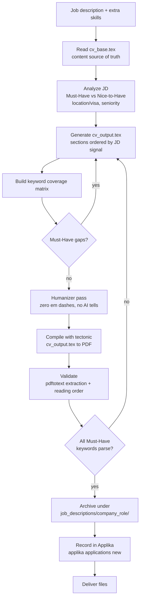

# CV Adjuster

ATS-optimized CV generation. Tailors a master LaTeX CV to a specific job description, maximizing compatibility with Applicant Tracking Systems, recruiter search, AI screening, and human review, without fabricating experience.

The full ruleset lives in [`CLAUDE.md`](CLAUDE.md). This README is the operational quick reference. It runs under Claude Code (reads `CLAUDE.md`) and OpenAI Codex (reads [`AGENTS.md`](AGENTS.md)); see [Using with Codex](#using-with-codex-and-other-agents).

## What this repo does

Given a job description, it produces:

- A tailored `cv_output.tex`, compiled to `your_name_curriculum_vitae.pdf`
- A per-company cover letter (`cover_letter_<company>.tex` / `.pdf`)
- A keyword coverage matrix (`coverage.md`)
- A durable archive under `job_descriptions/<company>_<role>/`
- An application tracking entry in [Applika](https://github.com/ProgramadoresSemPatria/applika)

## Layout

```text
cv-adjuster/
  CLAUDE.md            # full generation ruleset (source of truth for behavior)
  AGENTS.md            # Codex entry point; routes to CLAUDE.md
  README.md            # this file
  cv_base.tex          # master CV with ALL truthful experience (source of truth for content)
  cv_output.tex        # most recent tailored CV
  your_name_curriculum_vitae.pdf  # most recent compiled output (canonical filename)
  cover_letter_<company>.tex/.pdf   # per-company cover letters
  .claude/
    skills/
      applika-cli/     # Claude skill: track applications via the Applika CLI
      humanizer/       # Claude skill: strip AI-writing tells from generated text
  job_descriptions/
    <company>_<role>/  # durable per-application archive
      jd.md
      cv_output.tex
      your_name_curriculum_vitae.pdf
      cover_letter_<company>.tex/.pdf
      coverage.md
```

## Prerequisites

- [`tectonic`](https://tectonic-typst.dev/) for LaTeX compilation
- `pdftotext` (poppler) for extraction validation
- `applika-cli` for application tracking (see below)

## Generation workflow



Driven by an agent per `CLAUDE.md` (Claude Code) or `AGENTS.md` (Codex). High level:

1. Provide the job description and any extra target skills.
2. The base CV (`cv_base.tex`) is read as the content source of truth.
3. Requirements and keywords are analyzed (Must-Have vs Nice-to-Have, location/visa, seniority).
4. A tailored `cv_output.tex` is generated, sections ordered by JD signal.
5. A keyword coverage matrix is built; Must-Have gaps are fixed.
6. Humanizer pass runs (zero em dashes, no AI-style filler).
7. Compile and validate:

   ```bash
   tectonic cv_output.tex && mv cv_output.pdf your_name_curriculum_vitae.pdf
   pdftotext your_name_curriculum_vitae.pdf - > /tmp/cv_extracted.txt
   ```

8. Archive under `job_descriptions/<company>_<role>/`.
9. Record the application in Applika (see next section).

The hard rules (accuracy, ATS formatting, truthfulness) are non-negotiable and documented in `CLAUDE.md`.

## Applika tracking integration

[Applika](https://github.com/ProgramadoresSemPatria/applika) is a job-application tracker. Every generated application is also logged there via its CLI.

**Scope:** Applika stores application *metadata only* (company, role, platform, date, URLs, salary). It does **not** store or attach the CV/PDF. The tailored PDF stays in the local archive; Applika holds the tracking entry.

### One-time setup (per device)

Already installed in this environment via `pipx` (binary at `~/.local/bin/applika.exe`, on PATH). To reproduce on a new machine:

```bash
pipx install applika-cli      # or: uv tool install applika-cli
applika login                 # GitHub OAuth, session saved to ~/.config/applika/session.json
applika whoami                # confirm the session
```

`login` is interactive (opens a browser) and auto-refreshes, so it is needed only once per device. In a Claude Code session, run it yourself with `! applika login`.

### Claude skill

The recording step is backed by the `applika-cli` Claude skill, not raw CLI calls. See [Claude Code skills](#claude-code-skills) below for how it triggers and what it does. Reinstall the skill bundle with:

```bash
applika skill --dir "C:\Users\<user>\.claude\skills"
```

> Note: on Windows the CLI throws a harmless `UnicodeEncodeError` when printing its success arrow (`->`) under the cp1252 console. The copy completes before the crash; verify the directory exists rather than trusting the exit code.

### Recording an application

Run after the archive folder is populated, using metadata extracted from the JD:

```bash
applika applications new \
  --company "<company>" \
  --role "<role title>" \
  --platform "<LinkedIn | Email | company site | ...>" \
  --mode active \
  --date <YYYY-MM-DD> \
  --job-url "<JD link if known>" \
  --work-mode <remote | hybrid | on_site> \
  --country "<country if stated>" \
  --experience-level <intern..principal>
```

Rules:

- Required: `--company`, `--role`, `--platform`, `--mode`, `--date`.
- `--mode active` when you applied; `--mode passive` when a recruiter reached out first.
- Salary rule: if any salary flag (`--expected-salary`, `--salary-min`, `--salary-max`) is passed, both `--currency` and `--salary-period` become mandatory.
- Omit optional flags whose value is unknown rather than guessing.
- This writes to your remote Applika account, an outward-facing action: confirm before running.
- If `applika whoami` fails or the CLI is missing, skip tracking and run the one-time setup, rather than failing the CV workflow.

### Other Applika commands

```bash
applika applications list
applika applications edit [ID]
applika applications steps list [ID]
applika applications steps add [ID] --step <step> --date <YYYY-MM-DD>
applika applications finalize [ID] --step <step> --feedback <text> --date <YYYY-MM-DD>
```

## Claude Code skills

Two Claude Code skills ship in `.claude/skills/` and drive parts of the workflow. They are skills, not shell tools: trigger them inside a Claude Code session by name (`/skill-name`) or by phrasing that matches their description. Claude loads the skill file and follows it.

### applika-cli

- **Location:** `.claude/skills/applika-cli/SKILL.md`
- **Invoke:** `/applika-cli`, or just mention "applika" (log, list, create, edit an application). It auto-triggers on those.
- **What it does:** wraps the Applika CLI for application tracking. It enforces login-first: it runs `applika whoami` to verify the session before any other command, and walks the `applications new/list/edit/steps/finalize` flows with the right flags. This is the layer the workflow's "record in Applika" step uses, so you get consistent metadata instead of hand-typed CLI calls.
- **Install:** `applika skill --dir "<path>\.claude\skills"` (see the Applika section for the Windows note).

### humanizer

- **Location:** `.claude/skills/humanizer/SKILL.md`
- **Invoke:** `/humanizer`, or ask to "humanize" or de-AI a piece of text. It runs automatically as the mandatory humanizer pass (workflow step 6) over every CV, cover letter, and outreach message.
- **What it does:** strips signs of AI-generated writing, based on Wikipedia's "Signs of AI writing" guide. It removes inflated symbolism, promotional language, vague attributions, rule-of-three triplets, negative parallelisms, AI vocabulary, and filler, and enforces the project's hard ban on em dashes. The goal is output that reads like a strong engineer wrote it, with the technical precision intact.
- **License:** MIT, based on the Wikipedia guide. Bundled here so the humanizer pass is reproducible on any clone.

The hard rules these skills enforce (zero em dashes, no fabricated content, login-before-write) are also documented in `CLAUDE.md`, which is the source of truth if the skill text and the ruleset ever drift.

## Using with Codex (and other agents)

The project is not Claude-only. The same ruleset drives [OpenAI Codex](https://github.com/openai/codex) through [`AGENTS.md`](AGENTS.md), Codex's instruction-file convention.

- **Claude Code** reads `CLAUDE.md` and auto-loads the skills in `.claude/skills/`.
- **Codex** reads `AGENTS.md`, which routes to `CLAUDE.md` as the full ruleset and adapts the parts that assume Claude's skill system.

`CLAUDE.md` stays the single source of truth. `AGENTS.md` is a thin router, not a second copy, so the two cannot drift on the actual rules.

What changes under Codex:

- **No skill auto-trigger.** Codex has no `/applika-cli` or `/humanizer`. The skill files become reference docs the agent reads on demand: `.claude/skills/humanizer/SKILL.md` for the mandatory humanizer pass, `.claude/skills/applika-cli/SKILL.md` for the Applika flow.
- **Same CLI.** The `applika` CLI is agent-agnostic and behaves identically; `applika login` / `whoami` / `applications new` work the same.
- **Same prerequisites.** `tectonic`, `pdftotext`, `applika-cli`.

`applika skill` can install the Applika skill bundle into a Codex skills directory too; its interactive picker lists Claude, Gemini, Codex, and OpenCode.

## Output rules (non-negotiable)

- Final CV PDF is always `your_name_curriculum_vitae.pdf`.
- Cover letters are per-company: `cover_letter_<company>.pdf` / `.tex`.
- Every Must-Have keyword must appear in the CV and pass `pdftotext` extraction.
- Zero em dashes anywhere (CV, cover letter, outreach).
- No fabricated experience, metrics, or certifications.
